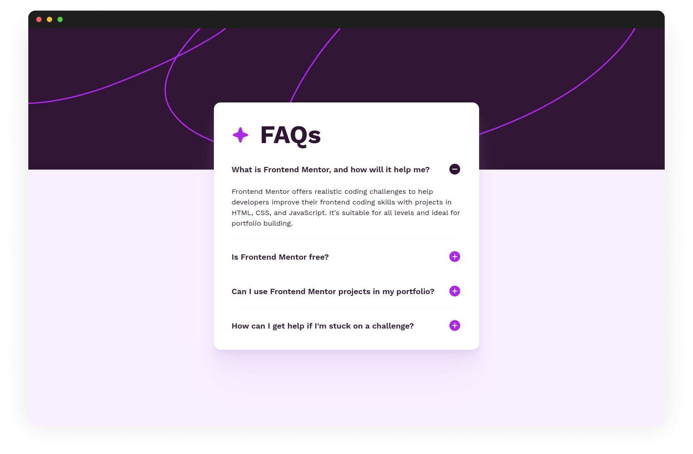

# Frontend Mentor - FAQ accordion solution

This is a solution to the [FAQ accordion challenge on Frontend Mentor](https://www.frontendmentor.io/challenges/faq-accordion-wyfFdeBwBz). Frontend Mentor challenges help you improve your coding skills by building realistic projects.

## Table of contents

- [Overview](#overview)
  - [The challenge](#the-challenge)
  - [Screenshot](#screenshot)
  - [Links](#links)
- [My process](#my-process)
  - [Built with](#built-with)
  - [What I learned](#what-i-learned)
  - [Useful resources](#useful-resources)
- [Author](#author)

## Overview

### The challenge

Users should be able to:

- [x] Hide/Show the answer to a question when the question is clicked
- [x] Navigate the questions and hide/show answers using keyboard navigation alone
- [x] View the optimal layout for the interface depending on their device's screen size
- [x] See hover and focus states for all interactive elements on the page

### Screenshot



### Links

- Solution URL: [Add solution URL here](https://your-solution-url.com)
- Live Site URL: [Add live site URL here](https://your-live-site-url.com)

## My process

### Built with

- React + TypeScript + Vite
- Semantic HTML5 markup
- CSS custom properties
- Mobile-first workflow
- Inline SVG with CSS transitions

### What I learned

Not a big deal, but I encountered a weird bug in Safari where the SVG icons are not changing from ➕ to ➖ and vice versa. I initially used the `rotate` CSS property to implement the transition between the two states, so I thought that Safari doesn't support it yet.

BUT when I checked using `@supports` it shows that Safari supports this property:

```css
@supports (rotate: -90deg) {
  body {
    color: red; /* font color changes to red on Safari */
  }
}
```

Anyway, I just used the old `transform: rotate(-90deg)` CSS rule which fixed the issue.

### Useful resources

- [Making Future Interfaces: Inline SVG - YouTube](https://www.youtube.com/watch?v=1CDTw_UpQoQ)
- [The simple trick to transition from height 0 to auto with CSS - YouTube](https://www.youtube.com/watch?v=B_n4YONte5A)
- [Accessible ARIA Accordions | scottohara.me](https://www.scottohara.me/blog/2017/10/25/accordion-release.html)
- [Accordion Pattern (Sections With Show/Hide Functionality) | APG](https://www.w3.org/WAI/ARIA/apg/patterns/accordion/)
- [My other FAQ accordion solution built with 11ty](https://www.frontendmentor.io/solutions/faq-accordion-card-ft-11ty-cube-css-postcss-and-vanilla-js-uiDvNLNLgM)

## Author

- Website - [Josh Javier](https://joshjavier.com/)
- Frontend Mentor - [@joshjavier](https://www.frontendmentor.io/profile/joshjavier)
